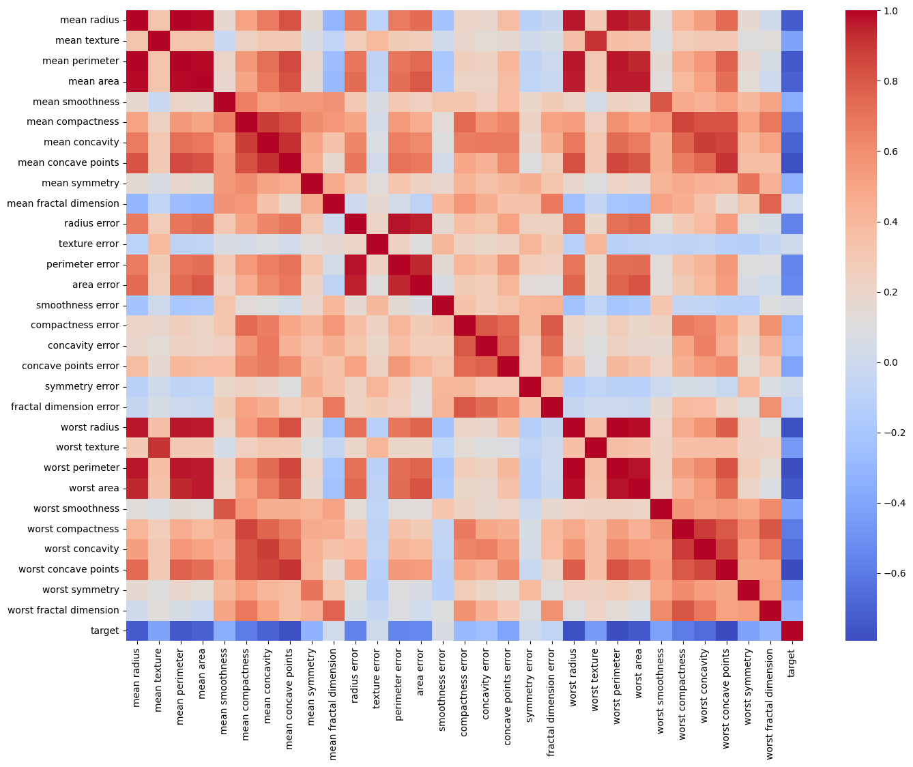
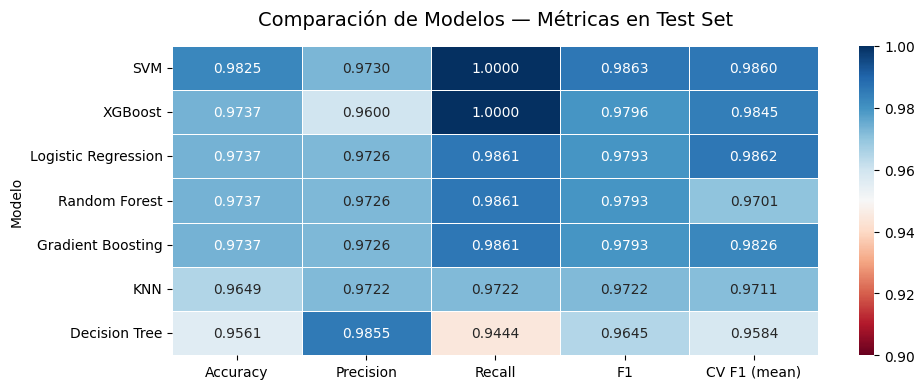
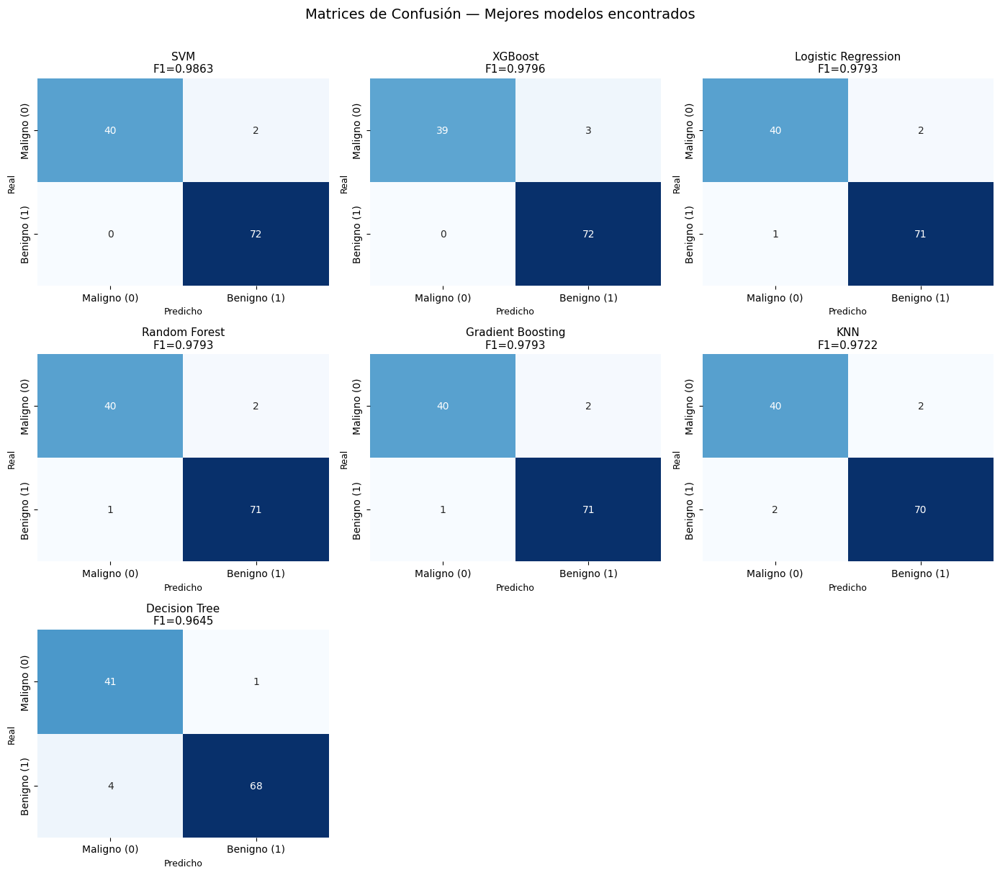

# 🩺 Breast Cancer Classification — Machine Learning Project

<div align="center">


</div>

---

# 📌 Project Overview

Breast cancer is one of the most critical health challenges worldwide, where early detection can significantly improve treatment success and patient survival.

This project explores how **Machine Learning** can help classify tumors as:

- 🔴 **Malignant**
- 🟢 **Benign**

using diagnostic measurements extracted from digitized breast mass images.

The project covers the complete Data Science workflow:

- 📊 Exploratory Data Analysis
- 🧹 Data preprocessing
- 🧠 Feature Engineering
- 📉 PCA (Dimensionality Reduction)
- 🤖 Machine Learning Modeling
- ⚙️ Hyperparameter Tuning
- 📈 Model Evaluation & Comparison

---

# 🖼️ Project Preview

## 📊 Correlation Heatmap



---

## 📈 Model Performance Comparison



---

## 📉 Confusion Matrix Visualization



---

# 🧬 Dataset Information

The project uses the famous:

> **Breast Cancer Wisconsin Diagnostic Dataset**

Each row represents measurements computed from cell nuclei in breast mass images.

Some important features include:

- Radius
- Texture
- Perimeter
- Area
- Smoothness
- Concavity
- Symmetry
- Fractal Dimension

### 🎯 Target Variable

| Value | Meaning |
|---|---|
| 0 | Malignant |
| 1 | Benign |

---

# 🛠️ Tech Stack

## 📚 Libraries & Tools

- Python
- Pandas
- NumPy
- Matplotlib
- Seaborn
- Scikit-learn
- 7 different ML models

---

# 📂 Project Structure

```bash
Breast-Cancer-Classification/
│
├── images/
│   ├── heatmap.png
│   ├── models_comparison.png
│   └── pca_visualization.png
│
├── Proyecto 3.ipynb
├── README.md
└── requirements.txt
```

---

# 🚀 Installation

## 1️⃣ Clone the repository

```bash
git clone https://github.com/yourusername/breast-cancer-classification.git
```

---

## 2️⃣ Navigate into the project

```bash
cd breast-cancer-classification
```

---

## 3️⃣ Install dependencies

```bash
pip install -r requirements.txt
```

---

## 4️⃣ Run Jupyter Notebook

```bash
jupyter notebook
```

---

# 🔎 Exploratory Data Analysis (EDA)

The dataset proved to be extremely clean and well-structured:

✅ No missing values  
✅ No duplicated rows  
✅ Balanced classes  
✅ Strong feature relationships

One of the most important discoveries during EDA was the presence of **high multicollinearity** between variables such as:

- `radius`
- `perimeter`
- `area`

especially among their:

- `mean`
- `worst`
- `standard error`

variants.

This suggested a significant amount of redundant information.

---

# 📊 Correlation Analysis

The heatmap revealed very strong relationships between several features.

For example:

- `mean radius`
- `mean perimeter`
- `mean area`

showed extremely high correlations.

This insight motivated:

- Feature reduction
- PCA experimentation
- Simpler feature subsets

---

# 🧠 Feature Engineering

To improve model efficiency and reduce redundancy:

- Highly correlated variables were analyzed
- Feature subsets were tested
- Scaling was applied where necessary
- PCA was integrated into selected pipelines

This helped create cleaner and more efficient models.

---

# 📉 Principal Component Analysis (PCA)

PCA was used to reduce dimensionality while preserving most of the dataset variance.

### 🎯 Objectives of PCA

- Reduce noise
- Improve computational efficiency
- Simplify feature space
- Test compressed representations

PCA was especially useful for:

- Logistic Regression
- KNN
- SVM

---

# 🤖 Machine Learning Models

The following models were trained and compared:

| Model | Category |
|---|---|
| Logistic Regression | Linear |
| KNN | Distance-Based |
| SVM | Margin-Based |
| Decision Tree | Tree-Based |
| Random Forest | Ensemble |
| Gradient Boosting | Ensemble |
| XGBoost | Boosting |

---

# ⚙️ Hyperparameter Tuning

All major models were optimized using:

- `GridSearchCV`
- Cross Validation
- F1-score optimization

### 🔍 Parameters Tested

- Tree depth
- Number of estimators
- Learning rate
- Regularization strength
- Number of neighbors
- Kernel types

This process helped identify the best-performing configurations while minimizing overfitting.

---

# 📈 Evaluation Metrics

The models were evaluated using:

- Accuracy
- Precision
- Recall
- F1-score
- Cross Validation Mean
- Confusion Matrix

---

# 🚨 Why Recall Matters

In medical diagnosis problems, **Recall** is critical.

A false negative means:

> Predicting a malignant tumor as benign.

This could delay treatment and create serious medical consequences.

For that reason, the project focused heavily on maintaining strong:

- Recall
- Precision
- F1-score

balance.

---

# 🏆 Key Insights

---

## 📌 Insight #1 — Many Features are Redundant

Several variables carried overlapping information.

Reducing redundancy simplified the pipeline without significantly hurting model quality.

---

## 📌 Insight #2 — PCA Preserved Strong Performance

Dimensionality reduction retained most predictive power while reducing complexity.

---

## 📌 Insight #3 — Ensemble Models Dominated

Tree ensemble methods captured complex non-linear relationships particularly well.

Models like:

- Random Forest
- Gradient Boosting
- XGBoost

generally achieved the strongest results.

---

# 📊 Results Summary

| Metric | Performance |
|---|---|
| Accuracy | Excellent |
| Recall | Very Strong |
| Precision | Very Strong |
| Generalization | Strong |
| Overfitting | Minimal |

---

# 🎯 Final Conclusion

This project demonstrates how combining:

- robust preprocessing,
- careful feature engineering,
- dimensionality reduction,
- and systematic model optimization

can produce highly reliable Machine Learning systems for medical classification problems.

Beyond predictive performance, the project emphasizes the importance of:

- interpretability,
- generalization,
- and responsible metric selection

when working in healthcare-related domains.

---

# 🔮 Future Improvements

Some ideas for future versions:

- 🔍 SHAP Explainability
- 📈 ROC-AUC Optimization
- 🧠 Deep Learning Models
- 🌐 Flask/FastAPI Deployment
- 📊 Interactive Dashboards
- ☁️ Cloud Deployment

---

# 👨‍💻 Author

## Rubén Cuello

💡 Data Scientist & Full Stack Developer  
🧠 Passionate about Machine Learning, AI & Data Analysis

---

# ⭐ Support

If you found this project interesting:

- ⭐ Star the repository
- 🍴 Fork the project
- 🧠 Share suggestions
- 🚀 Contribute improvements

---

# 📬 Contact

## GitHub

```bash
https://github.com/Ruben221b
```

## LinkedIn

```bash
https://www.linkedin.com/in/rubendcuello/
```